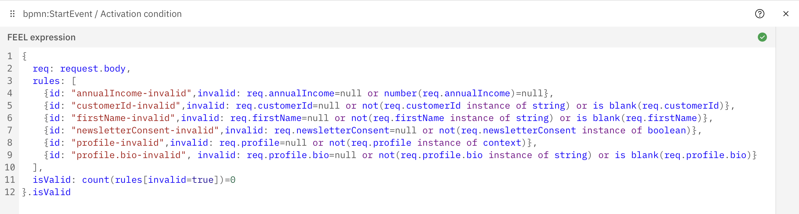
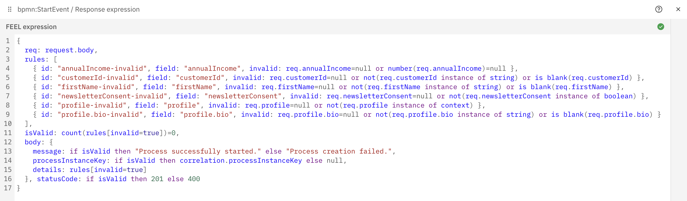

# FEEL Validation Generator

Maven plugin that reads an OpenAPI 3.x document (JSON or YAML) and emits FEEL validation expressions for Camunda webhook connectors (Inbound and Intermediate). Drop the output into the connector's `activationCondition` or `responseExpression` field to keep request validation — required body fields and required query parameters — aligned with your API contract.

Java 21. One runtime dependency, `swagger-parser` (which brings Jackson along). No DI framework, no mocking framework.

> **Development transparency.** Claude (Anthropic's AI assistant) is used to support development on this project. Every change still follows standard engineering practices — TDD, clean code, small focused classes — and all code is reviewed for correctness, security, and architectural fit before it lands on `main`.

## Usage

Wire the plugin into your build:

```xml
<plugin>
  <groupId>com.consid.automation.camunda</groupId>
  <artifactId>feel-validation-generator</artifactId>
  <version>1.0.0</version>
  <executions>
    <execution>
      <goals><goal>generate-feel</goal></goals>
      <configuration>
        <openApiSpec>${project.basedir}/src/main/resources/openapi.yaml</openApiSpec>
        <outputFile>${project.build.directory}/feel/validation.feel</outputFile>
      </configuration>
    </execution>
  </executions>
</plugin>
```

Or run it once from the command line:

```bash
mvn com.consid.automation.camunda:feel-validation-generator:1.0.0:generate-feel \
  -DfeelValidationGenerator.openApiSpec=openapi.yaml \
  -DfeelValidationGenerator.outputFile=target/validation.feel
```

## Configuration

| Parameter | Property | Default | Notes |
|---|---|---|---|
| `openApiSpec` | `feelValidationGenerator.openApiSpec` | — | **Required.** Path to the OpenAPI 3.x document. Relative paths resolve against `${project.basedir}`. |
| `outputFile` | `feelValidationGenerator.outputFile` | — | **Required.** FEEL output destination; parent dirs are created. Relative paths resolve against `${project.basedir}`. |
| `addResponse` | `feelValidationGenerator.addResponse` | `false` | `true` emits a response expression, `false` an activation condition. |
| `successStatusCode` | `feelValidationGenerator.successStatusCode` | `201` | HTTP status returned in response mode when validation passes. |
| `failStatusCode` | `feelValidationGenerator.failStatusCode` | `400` | HTTP status returned in response mode when validation fails. |
| `methods` | `feelValidationGenerator.methods` | `POST,PUT,PATCH` | Comma-separated HTTP methods to scan. Add `GET` for query-parameter-only webhooks. |
| `mediaType` | `feelValidationGenerator.mediaType` | `application/json` | Request body media type to read schemas from. Matched ignoring parameters and case; `application/json` also accepts `application/*+json`. |

Status codes must fall in 100–599 or the build fails fast. Spec problems (unparseable document, unresolved `$ref`) fail the build with a plain message; parser validation messages such as a misspelled keyword are logged as warnings.

### Programmatic use

```java
FEELValidationGenerator.builder()
    .withOpenApiPath(Path.of("openapi.yaml"))
    .withOutputFilePath(Path.of("target/validation.feel"))
    .build()
    .generate();
```

The Builder mirrors the Mojo parameters (`withResponse`, `withMediaType`, …) and adds `withWarningConsumer(Consumer<String>)` for [diagnostics](#diagnostics). `generate()` throws the unchecked `FEELGenerationException` when the document cannot be parsed, a `$ref` cannot be resolved, or the output cannot be written; `build()` rejects invalid configuration with `IllegalArgumentException` / `NullPointerException`. Only `FEELValidationGenerator`, its `Builder`, `FEELGenerationException`, and the Mojo are part of the public API — everything under `com.consid.automation.camunda.internal.*` may change between versions.

## Output modes

Both examples below are the generator's verbatim output for this operation:

```yaml
paths:
  /customers:
    post:
      parameters:
        - { name: tenant, in: query, required: true, schema: { type: string, enum: [acme, globex] } }
      requestBody:
        content:
          application/json:
            schema:
              type: object
              required: [customerId, email, age]
              properties:
                customerId: { type: string }
                email:      { type: string, format: email }
                age:        { type: integer, minimum: 18 }
```

### Activation condition (`addResponse=false`)

Boolean FEEL for the connector's `activationCondition` field. Invalid payloads never start a process instance — the caller receives the connector's static `422` fallback.

```feel
# POST /customers
{
  req: request.body,
  rules: [
    {invalid: req.age=null or not(req.age instance of number) or req.age<18},
    {invalid: req.customerId=null or not(req.customerId instance of string)},
    {invalid: req.email=null or not(req.email instance of string) or not(matches(req.email, "^[^@\\s]+@[^@\\s]+\\.[^@\\s]+$"))},
    {invalid: request.params.tenant=null or not(request.params.tenant instance of string) or not(request.params.tenant in ("acme", "globex"))}
  ],
  isValid: count(rules[invalid=true])=0
}.isValid
```



### Response expression (`addResponse=true`)

Context FEEL for the connector's `responseExpression` field. The webhook **always** starts a process instance; the FEEL only shapes the response body and status code. To halt the BPMN on invalid input, add a script task that re-validates and terminates.

```feel
# POST /customers
{
  req: request.body,
  rules: [
    { id: "age-invalid", field: "age", invalid: req.age=null or not(req.age instance of number) or req.age<18 },
    { id: "customerId-invalid", field: "customerId", invalid: req.customerId=null or not(req.customerId instance of string) },
    { id: "email-invalid", field: "email", invalid: req.email=null or not(req.email instance of string) or not(matches(req.email, "^[^@\\s]+@[^@\\s]+\\.[^@\\s]+$")) },
    { id: "params.tenant-invalid", field: "params.tenant", invalid: request.params.tenant=null or not(request.params.tenant instance of string) or not(request.params.tenant in ("acme", "globex")) }
  ],
  isValid: count(rules[invalid=true])=0,
  body: {
    message: if isValid then "Process successfully started." else "Process creation failed.",
    processInstanceKey: if isValid then correlation.processInstanceKey else null,
    details: rules[invalid=true]
  }, statusCode: if isValid then 201 else 400
}
```

Rules are ordered body fields first (alphabetically), then query parameters. Regex patterns are emitted as FEEL string literals, so backslashes appear doubled.



## What is supported

**Every clause the generator emits describes when the field is _invalid_** — the rule evaluates to `true` to reject the payload. The default body is `field=null or <type-violation>`; constraints, modifiers, and triggers extend it while preserving that reading.

### Types

| OpenAPI type / format | Violation clause |
|---|---|
| `type: string` | `not(X instance of string)` |
| `type: string, format: date` / `date-time` / `time` | `date(X)=null` / `date and time(X)=null` / `time(X)=null` |
| `type: number` / `type: integer` | `not(X instance of number)` |
| `type: boolean` | `not(X instance of boolean)` |
| `type: array` | `not(X instance of list)` |
| `type: object` | `not(X instance of context)` |

Modifiers that layer on top of the type clause:

- `enum` adds `or not(X in (…))`. `const: v` is treated as a single-value enum.
- `nullable: true` (3.0) / `type: [<t>, "null"]` (3.1) flips the rule to `field!=null and (…)` — missing is allowed, only present-but-malformed is rejected.

### Value constraints

Each keyword is only emitted when declared — there is no implicit "non-empty" assumption.

**Strings** (including `date` / `date-time` / `time`):

| Keyword | Violation clause |
|---|---|
| `minLength: N` / `maxLength: N` | `string length(X)<N` / `string length(X)>N` |
| `pattern: <regex>` | `not(matches(X, "<regex>"))` |
| `format: email` / `uuid` / `uri` | matches a built-in regex (only when no explicit `pattern` is set) |

**Arrays:**

| Keyword | Violation clause |
|---|---|
| `minItems: N` / `maxItems: N` | `count(X)<N` / `count(X)>N` |
| `items: <schema>` | `(some e in X satisfies (<element-violation>))` — recurses into the element schema, including its own required fields |

**Numbers** (`number` and `integer`):

| Keyword | Violation clause |
|---|---|
| `minimum: N` / `maximum: N` | `X<N` / `X>N` |
| `exclusiveMinimum` / `exclusiveMaximum` | `X<=N` / `X>=N` — both 3.0 boolean and 3.1 numeric forms are recognized |
| `multipleOf: N` | `modulo(X, N)!=0` |

**Objects:**

| Keyword | Violation clause |
|---|---|
| `additionalProperties: false` | `(not(every k in get entries(X).key satisfies (k in (<declared keys>))))` — emits a separate `rootObject-invalid` rule when set at the root |

### Query parameters

Parameters declared with `in: query` and `required: true` — on the operation itself or inherited from the path item — become rules of their own. The Camunda webhook connector exposes query parameters under `request.params`, so these rules read from there instead of `req` (`request.body`):

```yaml
parameters:
  - name: tenant
    in: query
    required: true
    schema: { type: string, enum: [acme, globex] }
  - name: page-size
    in: query
    required: true
    schema: { type: string, pattern: "^[0-9]+$" }
  - name: limit
    in: query
    required: true
    schema: { type: integer }
```

```feel
{invalid: request.params.limit=null},
{invalid: get value(request.params, "page-size")=null or not(get value(request.params, "page-size") instance of string) or not(matches(get value(request.params, "page-size"), "^[0-9]+$"))},
{invalid: request.params.tenant=null or not(request.params.tenant instance of string) or not(request.params.tenant in ("acme", "globex"))}
```

- Query parameter values arrive as **strings**, so only `type: string` schemas keep their constraints (`enum` / `const`, `pattern`, `minLength` / `maxLength`, `format`). Any other type (`integer`, `number`, `boolean`, `array`) is reduced to a presence check — `?limit=abc` passes.
- `nullable` is ignored: `required: true` on a query parameter means "must be present".
- Names that are not plain FEEL identifiers (`page-size`, `filter[status]`) or that collide with FEEL keywords (`in`, `and`, `null`, …) are read via `get value(request.params, "<name>")`, which the engine parses regardless of the name.
- An operation-level parameter overrides a same-named path-level one. `$ref` parameters (`#/components/parameters/*`) are resolved. Header, cookie, and optional parameters are ignored.
- In response mode the rule is identified as `params.<name>` (`id: "params.tenant-invalid", field: "params.tenant"`), so it cannot collide with a body field of the same name.
- An operation without a request body still produces a block when it declares required query parameters; such a block omits the unused `req: request.body` alias. Rules are emitted body fields first, then query parameters sorted by name.

### Composition

- **`$ref`** is resolved against `#/components/schemas/*`. An unresolved ref fails the build; the error names the endpoint.
- **`allOf`** merges every branch's `required` list into the parent. A `required` name declared next to the `allOf` is resolved from the branch that declares the property, so it keeps its type constraints.
- **`oneOf` + `discriminator.mapping`** guards each branch's required fields by the discriminator value and pins the discriminator property to the mapping keys:
  ```yaml
  oneOf:
    - $ref: "#/components/schemas/InvoicePaid"
    - $ref: "#/components/schemas/InvoiceFailed"
  discriminator:
    propertyName: type
    mapping:
      invoice.paid:   "#/components/schemas/InvoicePaid"
      invoice.failed: "#/components/schemas/InvoiceFailed"
  ```
- **`oneOf` / `anyOf` without a discriminator** are union-merged (all branches' required fields accumulated). The generated FEEL is stricter than the spec implies; a warning is emitted.
- A property using `allOf` / `oneOf` / `anyOf` without an explicit `type: object` is still treated as an object so inner required fields are honored.

### Conditional requirements

Two JSON Schema keywords scope a requirement to a runtime condition; multiple triggers on the same field OR-merge.

- **`dependentRequired: { trigger: [<dependent>, …] }`** — if `trigger` is present, the dependents are required. The dependent's rule becomes `trigger!=null and (<dependent-violation>)`.
- **`if`/`then`** — if a single property in `if.properties` matches its `const` / `enum`, the `then.required` fields are required:
  ```yaml
  if:
    properties: { paymentMethod: { const: card } }
    required:   [paymentMethod]
  then:
    required:   [cardNumber]
  ```
  Emits `req.paymentMethod="card" and (<cardNumber-violation>)`. `enum` predicates render as `in (…)`; boolean `const` triggers render as the bare path (`req.flag` / `not(req.flag)`).

Nested-object required fields inherit a conditionally-required parent's triggers, so inner rules only fire when the parent's condition holds. A plain-optional parent's inner required fields are omitted.

### Restrictions

- `if`/`then` outside the single-property `const` / `enum` subset is skipped — no multi-property `if`, no nested logic, no `pattern` / range / length predicates, no `else`.
- `if`/`then` dependents must be sibling property names. To scope a conditional to nested fields, place the `if`/`then` inside the nested object's schema.
- Schema-form `additionalProperties` (a sub-schema, not a boolean) is not honored — only `additionalProperties: false`.
- When a schema declares its own `properties`, swagger-parser discards `required` names that aren't among them before this plugin runs, so a typo in `required` next to a `properties` block cannot be detected here. A `required` name on a schema without its own `properties` is resolved through `allOf` branches; if it exists nowhere, a presence-only rule plus a warning is emitted.
- Query parameters with a non-string schema are presence-checked only (values arrive as strings; see [Query parameters](#query-parameters)).
- Not yet supported: `uniqueItems`, `minProperties` / `maxProperties`, `readOnly` / `writeOnly`, format-driven validations beyond `date` / `date-time` / `time` / `email` / `uuid` / `uri`, request inputs other than `request.body` and `request.params` (headers, cookies, path parameters).

### Diagnostics

The generator warns instead of silently dropping or weakening a rule. Each message is prefixed `[<location>] …` (field path, `$ref`, `(root)`, or the spec file name). Warned cases:

- OpenAPI parser validation messages — a misspelled keyword such as `minLenght`, a missing `info` block, an unexpected attribute.
- `if`/`then` outside the supported subset.
- `oneOf` without `discriminator.mapping`.
- Schema-form `additionalProperties`.
- A `required` name that no schema (including `allOf` branches) declares.

The Maven Mojo logs warnings via `getLog().warn(...)`. Programmatic callers consume them with `Builder.withWarningConsumer(Consumer<String>)`.

## Pinning BPMN to the generated FEEL

For consumer projects that own both the OpenAPI spec and the BPMN process models, a self-contained template test at [docs/examples/WebhookActivationConditionTest.java](docs/examples/WebhookActivationConditionTest.java) walks every `*.bpmn` under `src/test/resources/bpmn/`, reads each webhook event's `activationCondition`, and compares it against the matching block in a checked-in generator output file. Copy it into your project, wire the plugin's `outputFile` to that fixture path, and any drift between BPMN and the generated FEEL fails your build. See [docs/examples/README.md](docs/examples/README.md).

## Build

```bash
mvn verify              # tests, Javadoc doclint, coverage gate (90% line / 80% branch)
mvn install             # install the plugin into the local repository
```
